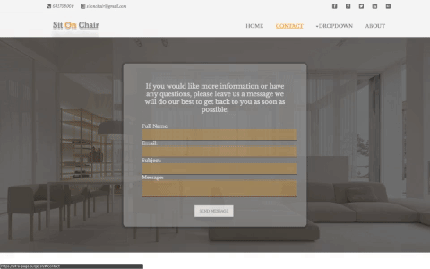

# Website - ReactJS&nbsp;&nbsp;&nbsp;&nbsp;&nbsp;




## About
> Project is made with JavaScript library, and it's fully responsive.
> The messagess from the contact form are send to the GraphQL API, as a JSON data type.
> Deployed on static server and published by Surge. [Link page.](https://ultra-page.surge.sh)
> 
## Let's start
```
$ git clone https://github.com/patrikswiatek/Website-ReactJS
    
$ cd Website-ReactJS

$ npm i

$ npm start
```
    
## Documentation

  * #### [React](https://reactjs.org/docs/getting-started.html)
  * #### [Create React App](https://github.com/facebook/create-react-app)


## Languages and tools

#### HTML
- root

#### CSS

#### SCSS
- [Gulp](https://gulpjs.com)

#### JavaScript
- [React](http://facebook.github.io/react)

#### ECMA Script 6
#### IDE 
- [WebStorm 2017.3.3](https://www.jetbrains.com/webstorm)

#### RWD

#### Webpack

#### [ GraphQL API](https://github.com/marmelab/json-graphql-server)

#### [Static server with Surge](https://surge.sh)

## License
* #### [MIT License](https://opensource.org/licenses/MIT)
